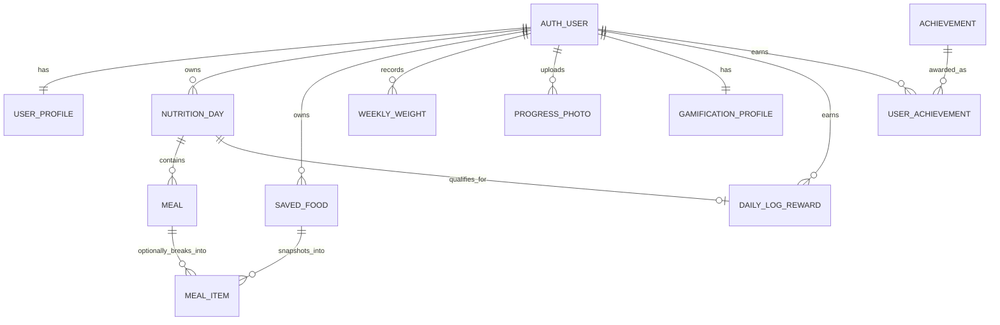

# DailyFuel — ERD and Database Schema

**Schema version:** 1.0\
**Backend:** Django / Django REST Framework\
**Database:** PostgreSQL recommended

This schema covers DailyFuel's agreed scope: daily calories/protein/carbohydrate/fat targets, whole-meal or optional itemized food logging, private weekly weight/photos, and lightweight logging-based gamification. It intentionally contains no exercise entities.

## Entity relationship diagram

## Schema conventions

- Use Django's configured authentication user as `AUTH_USER`; do not create a second password table.
- All user-owned queries must be scoped to the authenticated user.
- Use `DecimalField`/PostgreSQL `NUMERIC`, not floating point, for calories, macros, and body weight.
- Suggested precision: calories `NUMERIC(9,2)`, macros `NUMERIC(9,2)`, weight in kg `NUMERIC(7,3)`.
- Store dates as date-only values. Store event timestamps as timezone-aware timestamps.
- Store weight in kilograms; convert at the API/UI boundary according to the profile preference.
- Use UUID primary keys for app-owned entities if that matches the project convention; the standard Django auth user key may retain its configured type.
- Add `created_at` and `updated_at` timestamps to mutable records unless noted.

## Tables

### `saved_food`

An owner-scoped, optionally archived reusable food definition. Serving nutrition is read only when a food is added; the resulting meal item stores its own snapshot so later edits or archiving never change history.

| Column | Type | Rules |
|---|---|---|
| `user_id` | FK to auth user | Required, owner scoped |
| `name` / `brand` | VARCHAR | Name required; brand optional |
| `serving_amount_g` | NUMERIC(9,2) | Positive |
| `calories_per_serving`, `protein_g_per_serving`, `fat_g_per_serving` | NUMERIC(9,2) | Nonnegative |
| `carbs_g_per_serving` | NUMERIC(9,2) | Optional, nonnegative; detail only, never a daily target |
| `is_archived` | BOOLEAN | Archived foods cannot be newly logged |

`MealItem.saved_food`, `source_type`, `amount_g`, `serving_amount_snapshot_g`, and `carbs_g` retain traceability and calculated historical values. The existing `calories`, `protein_g`, `carbohydrate_g`, and `fat_g` columns remain authoritative for meal totals.

### `user_profile`

One-to-one extension of Django's auth user.

| Column | Type | Rules |
|---|---|---|
| `id` | UUID / project PK | Primary key |
| `user_id` | FK to auth user | Unique, cascade on user deletion |
| `display_name` | VARCHAR(100) | Nullable/blank allowed |
| `timezone` | VARCHAR(64) | IANA timezone; default from deployment/user locale, validated |
| `locale` | VARCHAR(5) | `en` or `ar`; default `en` |
| `weight_unit` | VARCHAR(2) | `kg` or `lb`; default `kg` |
| `created_at` | TIMESTAMPTZ | Required |
| `updated_at` | TIMESTAMPTZ | Required |

Authentication credentials and Google identity are managed by the authentication integration, not duplicated in this profile table.

### `nutrition_day`

One user's target snapshot for one local calendar date. Create lazily when the day is first opened for editing or mutated. If a target-only date is saved, it still has a row even with no meals.

| Column | Type | Rules |
|---|---|---|
| `id` | UUID / project PK | Primary key |
| `user_id` | FK to auth user | Required, cascade |
| `local_date` | DATE | Required; user's local calendar date |
| `target_calories` | NUMERIC(9,2) | Nonnegative |
| `target_protein_g` | NUMERIC(9,2) | Nonnegative |
| `target_carbohydrate_g` | NUMERIC(9,2) | Nonnegative |
| `target_fat_g` | NUMERIC(9,2) | Nonnegative |
| `created_at` | TIMESTAMPTZ | Required |
| `updated_at` | TIMESTAMPTZ | Required |

**Constraints/indexes:** unique `(user_id, local_date)`; index `(user_id, local_date DESC)`. On first creation, copy the closest earlier saved day's target snapshot; if none exists, use the user's initial target setup. Editing this row must not update any other date.

Consumed totals are calculated from its meals; do not persist a second, independently editable total.

### `meal`

One meal in a nutrition day. A meal is either quick-total or itemized. `entry_mode` determines the authoritative nutrition values.

| Column | Type | Rules |
|---|---|---|
| `id` | UUID / project PK | Primary key |
| `nutrition_day_id` | FK to `nutrition_day` | Required, cascade |
| `name` | VARCHAR(80) | Required; default `Meal N` |
| `position` | SMALLINT | Nonnegative; controls display order |
| `entry_mode` | VARCHAR(12) | `quick` or `itemized` |
| `food_notes` | TEXT | Optional list/description for memory; not parsed or estimated |
| `quick_calories` | NUMERIC(9,2) | Required/nonnegative in quick mode; null in itemized mode |
| `quick_protein_g` | NUMERIC(9,2) | Required/nonnegative in quick mode; null in itemized mode |
| `quick_carbohydrate_g` | NUMERIC(9,2) | Required/nonnegative in quick mode; null in itemized mode |
| `quick_fat_g` | NUMERIC(9,2) | Required/nonnegative in quick mode; null in itemized mode |
| `created_at` | TIMESTAMPTZ | Required |
| `updated_at` | TIMESTAMPTZ | Required |

**Rules:** In `quick` mode, meal totals come only from `quick_*`. In `itemized` mode, `quick_*` are null and totals are computed from `meal_item` rows. Do not count both. Validate mode transitions transactionally. Unique `(nutrition_day_id, position)` is recommended; reordering may use a temporary position strategy to avoid conflicts.

### `meal_item`

Optional itemized food rows for an itemized meal. Values describe that food's contribution to the meal; there is no food database lookup or weight-based scaling.

| Column | Type | Rules |
|---|---|---|
| `id` | UUID / project PK | Primary key |
| `meal_id` | FK to `meal` | Required, cascade |
| `name` | VARCHAR(120) | Required |
| `position` | SMALLINT | Nonnegative; controls item order |
| `calories` | NUMERIC(9,2) | Nonnegative |
| `protein_g` | NUMERIC(9,2) | Nonnegative |
| `carbohydrate_g` | NUMERIC(9,2) | Nonnegative |
| `fat_g` | NUMERIC(9,2) | Nonnegative |
| `created_at` | TIMESTAMPTZ | Required |
| `updated_at` | TIMESTAMPTZ | Required |

**Rules:** `meal_item` rows are valid only for an itemized meal. An itemized meal saved as complete must have at least one item. Item totals are the sum of its rows.

### `weekly_weight`

One body-weight measurement per user per progress week. A user may record it even if they have no photos that week.

| Column | Type | Rules |
|---|---|---|
| `id` | UUID / project PK | Primary key |
| `user_id` | FK to auth user | Required, cascade |
| `week_start` | DATE | Required; Monday date for the user's configured week |
| `measured_on` | DATE | Required; within the corresponding week |
| `weight_kg` | NUMERIC(7,3) | Required, positive |
| `note` | VARCHAR(500) | Optional |
| `created_at` | TIMESTAMPTZ | Required |
| `updated_at` | TIMESTAMPTZ | Required |

**Constraints/indexes:** unique `(user_id, week_start)`; index `(user_id, week_start DESC)`. Upsert this record for corrections; never create a second weight for that user/week.

### `progress_photo`

Private weekly body-progress photo. Photos share the one `weekly_weight` record for the week; a week with photos must have a weight before the first photo is finalized.

| Column | Type | Rules |
|---|---|---|
| `id` | UUID / project PK | Primary key |
| `user_id` | FK to auth user | Required, cascade |
| `week_start` | DATE | Required; Monday date; match the weekly weight |
| `captured_on` | DATE | Required; defaults to current local date |
| `file` | Private storage key / Django `FileField` | Required; never public-static |
| `label` | VARCHAR(40) | Optional, e.g. front/side/back |
| `note` | VARCHAR(500) | Optional |
| `position` | SMALLINT | Nonnegative display order within week |
| `created_at` | TIMESTAMPTZ | Required |
| `updated_at` | TIMESTAMPTZ | Required |

**Constraints/indexes:** index `(user_id, week_start, position)` and `(user_id, week_start DESC)`. Enforce at most four active photos for `(user_id, week_start)` inside a transaction/locked service operation; a normal row check constraint cannot enforce this aggregate limit. Validate actual image content and configured size cap. Require a matching `weekly_weight` before accepting the first photo for that week. Deleting a photo releases its slot.

### `gamification_profile`

One aggregate gamification row per user. Keep these values derived/updated by a backend service, not directly writable from client input.

| Column | Type | Rules |
|---|---|---|
| `id` | UUID / project PK | Primary key |
| `user_id` | FK to auth user | Unique, cascade |
| `xp_total` | BIGINT | Nonnegative; default 0 |
| `current_streak` | INTEGER | Nonnegative; default 0 |
| `longest_streak` | INTEGER | Nonnegative; default 0 |
| `last_logged_date` | DATE | Nullable; local date of most recent qualifying log |
| `created_at` | TIMESTAMPTZ | Required |
| `updated_at` | TIMESTAMPTZ | Required |

### `daily_log_reward`

Idempotency record granting the proposed once-per-date reward after at least one meal is saved.

| Column | Type | Rules |
|---|---|---|
| `id` | UUID / project PK | Primary key |
| `user_id` | FK to auth user | Required, cascade |
| `nutrition_day_id` | FK to `nutrition_day` | Required, cascade |
| `points_awarded` | INTEGER | Nonnegative; configured default reward |
| `awarded_at` | TIMESTAMPTZ | Required |

**Constraints:** unique `nutrition_day_id` (a day has one reward at most); unique pair `(user_id, nutrition_day_id)` for defense in depth. Create the reward and update the gamification profile in one transaction.

### `achievement`

Seeded catalog of neutral logging milestones. Achievement definitions are not user-owned.

| Column | Type | Rules |
|---|---|---|
| `id` | UUID / project PK | Primary key |
| `code` | VARCHAR(50) | Unique stable key |
| `title_en` | VARCHAR(100) | Required |
| `title_ar` | VARCHAR(100) | Required |
| `description_en` | VARCHAR(250) | Required |
| `description_ar` | VARCHAR(250) | Required |
| `logged_days_required` | INTEGER | Positive; threshold for award |
| `is_active` | BOOLEAN | Default true |

### `user_achievement`

Award record connecting a user to a seeded achievement.

| Column | Type | Rules |
|---|---|---|
| `id` | UUID / project PK | Primary key |
| `user_id` | FK to auth user | Required, cascade |
| `achievement_id` | FK to `achievement` | Required, protect seeded definition |
| `earned_at` | TIMESTAMPTZ | Required |

**Constraints:** unique `(user_id, achievement_id)` so each achievement is granted once.

## Relationship and deletion behavior

- Deleting a user cascades to profile, nutrition days/meals/items, weekly weights, photos, and gamification records. Photo object deletion must be queued/verified so database deletion does not leave indefinitely accessible media.
- Deleting a nutrition day cascades to its meals, items, and daily reward.
- Deleting a meal cascades to its itemized foods. Recalculate dashboard totals from remaining meals.
- Deleting a weekly weight is blocked while that week has photos; user must delete the photos first or retain the weight. This preserves the rule that photos have a weekly weigh-in.
- Deleting a photo removes it from the active weekly count and gallery.
- Achievement definitions are protected from deletion when awarded; deactivate instead.

## Derived calculations

For each `nutrition_day`:

- `consumed_calories = Σ quick_calories for quick meals + Σ item calories for itemized meals`
- `consumed_protein_g = Σ quick_protein_g for quick meals + Σ item protein_g for itemized meals`
- `consumed_carbohydrate_g = Σ quick_carbohydrate_g for quick meals + Σ item carbohydrate_g for itemized meals`
- `consumed_fat_g = Σ quick_fat_g for quick meals + Σ item fat_g for itemized meals`
- `remaining = target - consumed`; negative remaining is displayed as amount over target.

Do not persist these as independently mutable values. They may be cached only if cache invalidation is transactionally correct and the database-derived result remains authoritative.

## Core validation/integrity checks

1. Unique user + local date for nutrition days.
2. Nonnegative targets, meal values, and item values; decimal precision preserved.
3. Quick meals require combined nutrition values and contain no `meal_item` rows.
4. Itemized meals derive totals solely from their child items.
5. A date's target edit never mutates another date's snapshot.
6. Unique user + week start for weights; measured date belongs to that week.
7. Photos require a weight for the same user/week and active photo count never exceeds four.
8. Every media read and mutation checks ownership.
9. Daily rewards and achievements are idempotent.
10. Changing display weight unit never changes normalized stored kilograms.

## Weekly email reminder records

- `ReminderPreference`: one-to-one user (cascade); enabled flag, weekday 0–6, local time, include-photos flag, confirmed email/time, confirmation and unsubscribe nonces, last confirmation request time, next due timestamp, and cached schedule timezone. The authoritative timezone lives on Profile.
- `ReminderDelivery`: user FK (cascade), Monday local week, recipient, status, attempts, claim/sent/retry timestamps. Unique `(user, week_start)` reserves one weekly delivery decision. Rejections may reuse this record for up to three attempts; uncertain outcomes are never automatically retried.
- `ReminderDailyBudget`: UTC date primary key and aggregate reserved attempt count. It contains no individual user data and survives account deletion.

Consent changes, reservation, and sending checks use a consistent user → preference → delivery lock order. Daily budget reservations are transactional; external email acceptance cannot be atomic with database writes. See [reminder design and operations](weekly-email-reminders.md).
